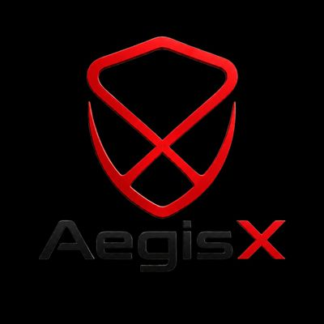
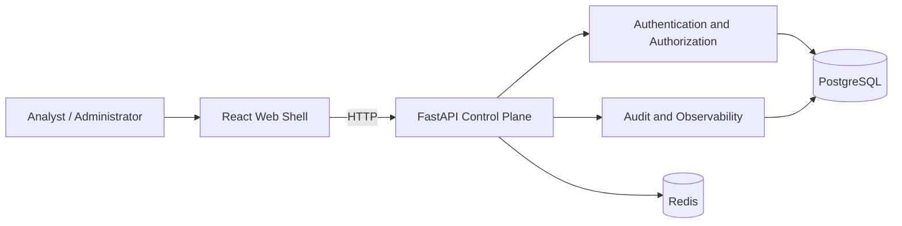

<div align="center">



**Tenant-isolated security operations infrastructure, built from the trust boundary outward.**

[](https://github.com/Adam-Ghanem/aegisx/actions/workflows/ci.yml)
[](https://www.python.org/)
[](https://fastapi.tiangolo.com/)
[](https://www.postgresql.org/)
[](https://redis.io/)
[](https://react.dev/)
[](https://www.docker.com/)
[](#project-status)

[Overview](#overview) · [Architecture](#architecture) · [Quick start](#quick-start) · [Security](#security-model) · [Roadmap](#roadmap)

</div>

---

## Overview

AegisX is an open security-operations platform under active development. The project starts with the control-plane concerns that are hardest to retrofit later: identity, tenant isolation, authorization, auditability, operational health, and reproducible delivery.

The current milestone is a **secure Phase 1 foundation**. It provides the runtime and security boundary required for later ingestion, detection, alerting, incident response, and analyst workflows without pretending those capabilities already exist.

### Implemented in Phase 1

- FastAPI control-plane API with OpenAPI support
- Organization and workspace tenancy model
- User memberships, roles, permissions, and deny-by-default policy primitives
- Memory-hard password hashing
- Signed short-lived access tokens
- Opaque rotating refresh tokens stored as keyed hashes
- Refresh-token replay detection and family revocation
- Login, refresh, and logout endpoints
- Append-oriented audit data model and safe metadata handling
- PostgreSQL persistence with explicit Alembic migrations
- Redis dependency health integration
- Structured JSON logging with request and correlation identifiers
- Liveness, readiness, and Prometheus-compatible metrics endpoints
- React and TypeScript application shell served through Nginx
- Docker Compose development stack
- CI checks for formatting, linting, typing, tests, security, dependency audits, frontend build, and container health

### Deliberately deferred

The following are planned for later milestones and are **not** presented as completed functionality:

- Telemetry ingestion and source management
- Canonical event normalization
- Detection rules and findings
- Alert triage and incident workflows
- Event search and long-term event storage
- Threat-intelligence enrichment
- Automation and playbooks
- Full SOC analyst dashboards

## Architecture

Phase 1 is implemented as a modular monolith. PostgreSQL is the authoritative system of record, while Redis is used only for bounded, non-authoritative runtime concerns. The frontend is a separate deployable web application that communicates with the API.



The target architecture separates the control plane from a future high-volume data plane. That later data plane will own ingestion, durable transport, normalization, detection, event storage, alerting, and notification delivery.

Detailed architecture decisions are documented in [`docs/adr`](docs/adr), with the broader system design in [`docs/system-architecture.md`](docs/system-architecture.md).

## Security model

AegisX treats isolation and authorization as backend invariants rather than UI behavior.

- Requests are denied unless an explicit policy allows the action.
- Tenant context is derived from authenticated state and validated membership.
- Client-supplied ownership fields never override trusted context.
- Refresh tokens are opaque, single-use, and persisted only as keyed hashes.
- Refresh-token replay revokes the entire token family.
- Passwords use a memory-hard salted hash.
- Authentication errors are intentionally generic.
- Credentials, raw tokens, and signing material are excluded from logs and audit metadata.
- Production configuration rejects development signing keys.
- Containers run without root privileges where supported and use `no-new-privileges`.
- Development ports bind to loopback by default.

The threat model, authorization rules, and tenant-isolation contract are maintained under [`docs/security`](docs/security).

> [!IMPORTANT]
> AegisX is not production-ready yet. The current release is a verified foundation for continued engineering, security review, and controlled development.

## Technology stack

| Area | Technology |
|---|---|
| API | Python 3.12, FastAPI, Pydantic |
| Persistence | PostgreSQL 17, SQLAlchemy 2, Alembic |
| Runtime state | Redis 8 |
| Web | React, TypeScript, Vite, TanStack Query |
| Delivery | Docker, Docker Compose, Nginx |
| Quality | Ruff, mypy, pytest, Bandit, pip-audit, npm audit |
| CI | GitHub Actions |

## Quick start

### Prerequisites

- Git
- Docker Desktop or Docker Engine with Compose v2
- Python 3.12 for local backend development
- Node.js 22 for local frontend development

### Run the full stack

```bash
git clone https://github.com/Adam-Ghanem/aegisx.git
cd aegisx
docker compose up --build --wait
```

The API container applies Alembic migrations before starting.

| Service | Address |
|---|---|
| Web application | `http://127.0.0.1:8080` |
| API | `http://127.0.0.1:8000` |
| API documentation | `http://127.0.0.1:8000/docs` |
| Liveness | `http://127.0.0.1:8000/health/live` |
| Readiness | `http://127.0.0.1:8000/health/ready` |
| Metrics | `http://127.0.0.1:8000/metrics` |

Stop the stack without deleting local volumes:

```bash
docker compose down
```

Local Compose credentials are development-only defaults. Use explicit secrets and controlled migration jobs in any shared or production-like environment.

## Local development

### Windows PowerShell

```powershell
py -3.12 -m venv .venv
.\.venv\Scripts\Activate.ps1
.\scripts\dev.ps1 setup
.\scripts\dev.ps1 validate
```

Start the local container stack:

```powershell
.\scripts\dev.ps1 start
```

### Linux or macOS

```bash
python3.12 -m venv .venv
. .venv/bin/activate
make setup
make validate
make start
```

See [`DEVELOPMENT.md`](DEVELOPMENT.md) for the complete development workflow and troubleshooting notes.

## API surface

The Phase 1 public API is intentionally small.

| Method | Endpoint | Purpose |
|---|---|---|
| `POST` | `/v1/auth/login` | Authenticate a user in an organization |
| `POST` | `/v1/auth/refresh` | Rotate a refresh token and issue a new token pair |
| `POST` | `/v1/auth/logout` | Revoke a refresh-token family |
| `GET` | `/health/live` | Process liveness |
| `GET` | `/health/ready` | PostgreSQL and Redis readiness |
| `GET` | `/metrics` | Prometheus-compatible HTTP counters |

Administrative APIs and security-operations domain APIs will be added only with complete authorization, tenant-isolation, audit, and test coverage.

## Repository layout

```text
.
├── apps/
│   ├── api/
│   │   ├── migrations/          # Alembic migration history
│   │   ├── src/aegisx/          # API, domain models, auth, security, observability
│   │   └── tests/               # API and persistence tests
│   └── web/                     # React and TypeScript application shell
├── docs/
│   ├── adr/                     # Architecture decision records
│   ├── operations/              # Operational and troubleshooting guidance
│   └── security/                # Threat model and isolation contracts
├── scripts/                     # Windows development commands
├── tests/security/              # Security-policy and boundary tests
├── compose.yaml                 # Local PostgreSQL, Redis, API, and web stack
├── Dockerfile                   # API image
├── Makefile                     # Linux and macOS development commands
└── pyproject.toml               # Python package and quality configuration
```

## Quality gates

The repository is configured to fail fast on formatting, correctness, security, and delivery regressions.

```bash
python -m ruff format --check .
python -m ruff check .
python -m mypy apps/api/src
python -m pytest
python -m bandit -c pyproject.toml -r apps/api/src
python -m pip_audit
npm --prefix apps/web run build
npm --prefix apps/web audit --audit-level=high
docker compose config --quiet
```

Pytest enforces an overall coverage floor, while security-policy branches are tested independently under `tests/security`.

## Project status

| Milestone | Status | Scope |
|---|---|---|
| Phase 0 | Complete | Requirements, architecture, threat model, storage and testing strategy |
| Phase 1 | In review | Secure control-plane foundation, authentication, tenancy, RBAC, audit, CI, containers |
| Phase 2 | Planned | Synthetic event-to-incident vertical slice |
| Phase 3 | Planned | Broader MVP capability and controlled pilot |
| Phase 4 | Planned | General availability hardening and operations |

The working roadmap is maintained in [`docs/roadmap.md`](docs/roadmap.md).

## Contributing

Changes should be made on a dedicated branch and submitted through a pull request. Security and tenant-isolation regressions are release blockers.

Before opening a pull request:

1. Run the complete validation suite.
2. Review the full diff and repository status.
3. Confirm that no credentials, local databases, caches, logs, or build artifacts are included.
4. Document affected trust boundaries, tests, operational impact, and rollback considerations.

Read [`CONTRIBUTING.md`](CONTRIBUTING.md) and [`SECURITY.md`](SECURITY.md) before submitting changes or reporting a vulnerability.

---

<div align="center">

**AegisX is being developed in public, one verified security boundary at a time.**

</div>